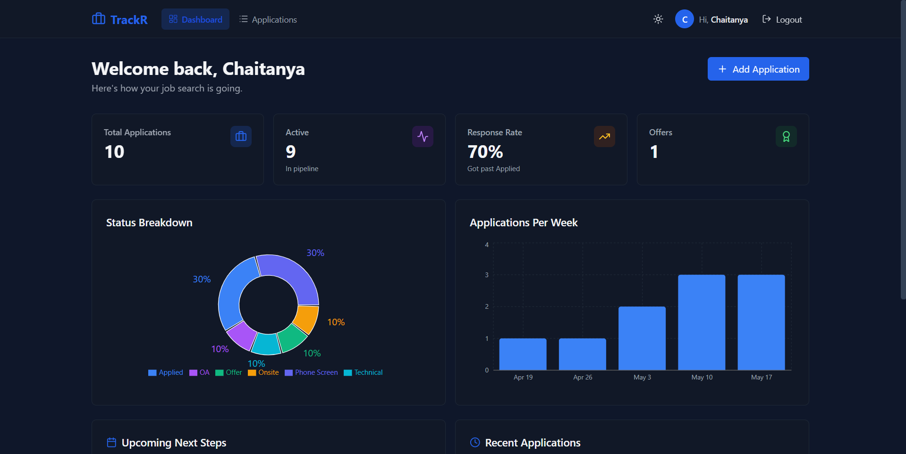
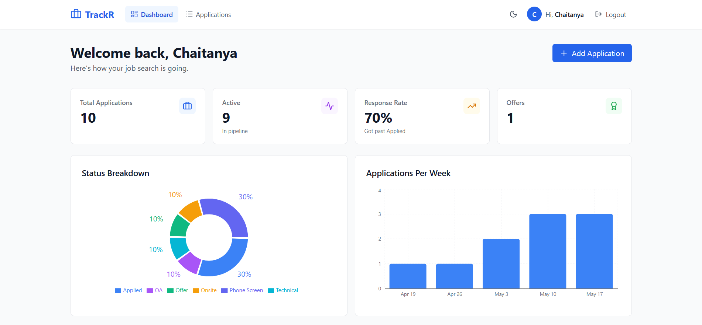
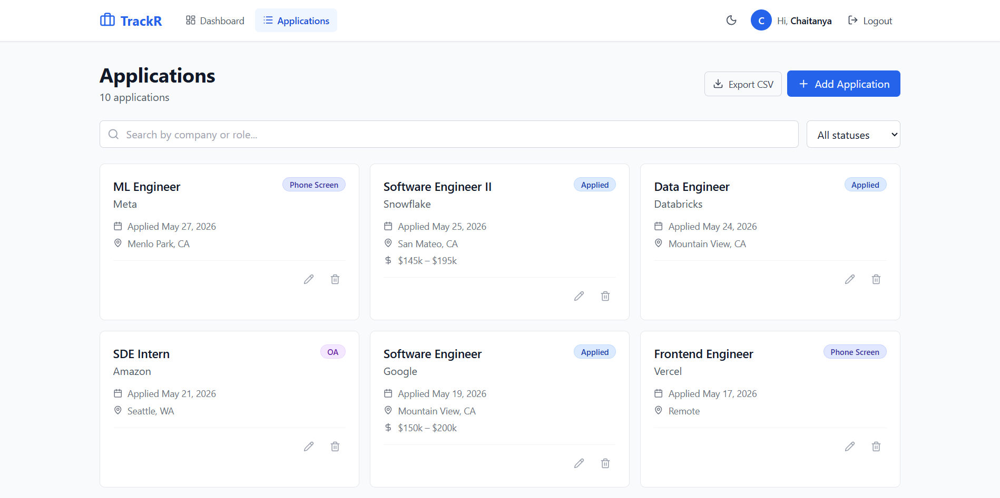
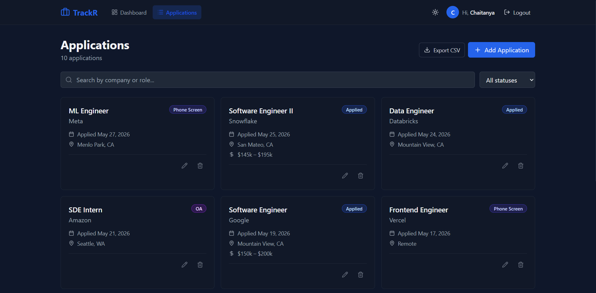
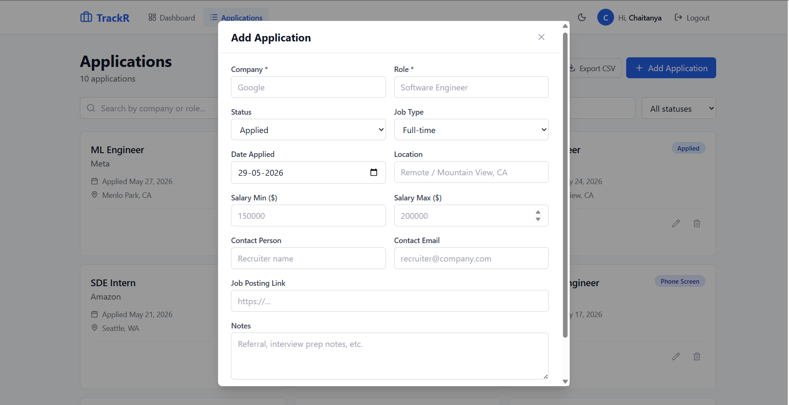
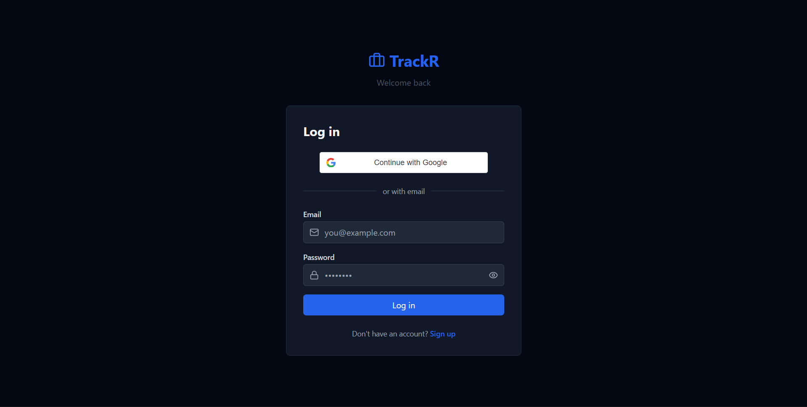

# TrackR

**A full-stack job application tracker for the modern job search.**

Track every application, every status update, every follow-up — with a dashboard that tells you whether your search strategy is actually working.

🔗 **Live demo:** [trackr-rouge.vercel.app](https://trackr-rouge.vercel.app)
📦 **Source code:** [github.com/chaitanya-020/TrackR](https://github.com/chaitanya-020/TrackR)

> ⚡ The backend is hosted on Render's free tier and may take ~30 seconds to wake up on the first request after inactivity.



---

## Features

- **Full CRUD for applications** — company, role, status pipeline (Applied → OA → Phone Screen → Technical → Onsite → Offer/Rejected), salary range, location, notes, contact info, job link
- **Dashboard analytics** — response rate, status breakdown donut chart, weekly application volume, upcoming follow-ups, recent activity
- **Hybrid authentication** — email/password (bcrypt + JWT) and Google OAuth 2.0 with account linking
- **Real-time search and filtering** — debounced search across company and role, status filter, instant UI updates
- **CSV export** — download your full application history, respects active filters
- **Dark mode** — system-preference detection with manual toggle, persisted across sessions
- **Mobile responsive** — works on phones, tablets, and desktops
- **Production polish** — toast notifications, loading skeletons, optimistic UI updates, validation everywhere

---

## Screenshots

### Dashboard
| Light | Dark |
|---|---|
|  |  |

### Applications page
| Light | Dark |
|---|---|
|  |  |

### Add application modal


### Login (with Google OAuth)


---

## Tech stack

**Frontend**
- React 18 + Vite
- Tailwind CSS (with `class`-based dark mode)
- React Router v6
- React Hook Form
- Recharts (data visualization)
- Axios (with request/response interceptors)
- `@react-oauth/google` for Google sign-in
- `react-hot-toast` for notifications

**Backend**
- Node.js + Express
- MongoDB Atlas + Mongoose
- JWT + bcryptjs for password auth
- `google-auth-library` for OAuth ID-token verification
- `express-validator` for request validation

**Infrastructure**
- Frontend deployed on Vercel
- Backend deployed on Render
- Database hosted on MongoDB Atlas (free tier)

---

## Architecture

```
┌──────────────┐         ┌─────────────────┐         ┌──────────────┐
│   Browser    │ ◄─────► │  Vercel (React) │ ◄─────► │ Render (API) │
└──────────────┘  HTTPS  └─────────────────┘   REST  └──────┬───────┘
                                                            │
                                                       JWT  │  Mongoose
                                                            ▼
                                                  ┌─────────────────┐
                                                  │  MongoDB Atlas  │
                                                  └─────────────────┘
```

### Design decisions

- **API layer abstraction** — components never call Axios directly; they import functions from `applicationsApi.js`. Makes endpoint changes a one-file edit.
- **Custom hooks for data logic** — `useApplications`, `useStats`, `useDebounce`, `useAuth` keep components presentational. Data fetching, debouncing, and state management live in hooks.
- **Server-side aggregation for the dashboard** — instead of fetching all applications and computing stats client-side, MongoDB's aggregation framework (`$group`, `$match`, `$cond`) computes stats at the database level. Scales correctly as the dataset grows.
- **Account linking** — users can sign up with email/password, then later link Google to the same account. The backend matches by `googleId` OR `email` and merges auth methods.
- **Compound indexes for multi-tenant queries** — `{ user: 1, dateApplied: -1 }` on the Application collection ensures fast user-scoped queries.

---

## Running locally

### Prerequisites
- Node.js 18+
- MongoDB Atlas account (free tier works)
- Google Cloud Console project with OAuth 2.0 credentials (optional, for Google sign-in)

### Setup

```bash
git clone https://github.com/chaitanya-020/TrackR.git
cd TrackR
```

**Backend:**
```bash
cd server
npm install
# Create server/.env (see "Environment variables" below)
npm run dev
# Runs on http://localhost:5000
```

**Frontend** (in a separate terminal):
```bash
cd client
npm install
# Create client/.env (see "Environment variables" below)
npm run dev
# Runs on http://localhost:5173
```

### Environment variables

**`server/.env`**
```
MONGO_URI=mongodb+srv://<user>:<password>@<cluster>.mongodb.net/trackr
JWT_SECRET=<a long random string>
JWT_EXPIRES_IN=7d
PORT=5000
NODE_ENV=development
CLIENT_URL=http://localhost:5173
GOOGLE_CLIENT_ID=<from Google Cloud Console>
GOOGLE_CLIENT_SECRET=<from Google Cloud Console>
```

**`client/.env`**
```
VITE_API_URL=http://localhost:5000/api
VITE_GOOGLE_CLIENT_ID=<same Client ID as backend>
```

---

## API reference

All `/api/applications/*` routes require a Bearer JWT in the `Authorization` header.

| Method | Endpoint | Description |
|---|---|---|
| `POST` | `/api/auth/signup` | Register with email/password |
| `POST` | `/api/auth/login` | Log in with email/password |
| `POST` | `/api/auth/google` | Sign in or sign up with Google (with account linking) |
| `GET` | `/api/auth/me` | Get current user (protected) |
| `GET` | `/api/applications` | List applications (supports `?status=`, `?search=`, `?sortBy=`, `?order=`, `?page=`, `?limit=`) |
| `POST` | `/api/applications` | Create application |
| `GET` | `/api/applications/:id` | Get one application |
| `PUT` | `/api/applications/:id` | Update application |
| `DELETE` | `/api/applications/:id` | Delete application |
| `GET` | `/api/applications/stats` | Aggregated dashboard stats |

---

## Project structure

```
TrackR/
├── client/                 # React frontend
│   ├── src/
│   │   ├── api/            # Axios client + endpoint functions
│   │   ├── components/     # Reusable presentational components
│   │   ├── context/        # AuthContext, ThemeContext
│   │   ├── hooks/          # useApplications, useStats, useDebounce
│   │   ├── pages/          # Login, Signup, Dashboard, Applications
│   │   └── utils/          # Constants, CSV export
│   └── vercel.json         # SPA routing rewrite for Vercel
│
├── server/                 # Express backend
│   ├── config/             # MongoDB connection
│   ├── controllers/        # Route handlers (auth, applications)
│   ├── middleware/         # JWT auth middleware
│   ├── models/             # Mongoose schemas
│   ├── routes/             # Route definitions + validation
│   └── server.js           # Entry point
│
└── docs/                   # Screenshots
```

---

## Roadmap

- **v1.1 — Chrome extension** ("Save to TrackR" button on LinkedIn, Indeed, company career pages)
- **v1.2 — Gmail integration** (auto-update application status from received confirmation/rejection emails)
- **v1.3 — Follow-up reminders** (email + in-app notifications for upcoming next steps)
- **v1.4 — Kanban view** (drag-and-drop applications between status columns)

---

## Author

**Sai Chaitanya Gelivi**
Master's in Computer Science, University of Oklahoma
[github.com/chaitanya-020](https://github.com/chaitanya-020) · [LinkedIn](https://www.linkedin.com/in/<your-handle>)

---

## License

MIT